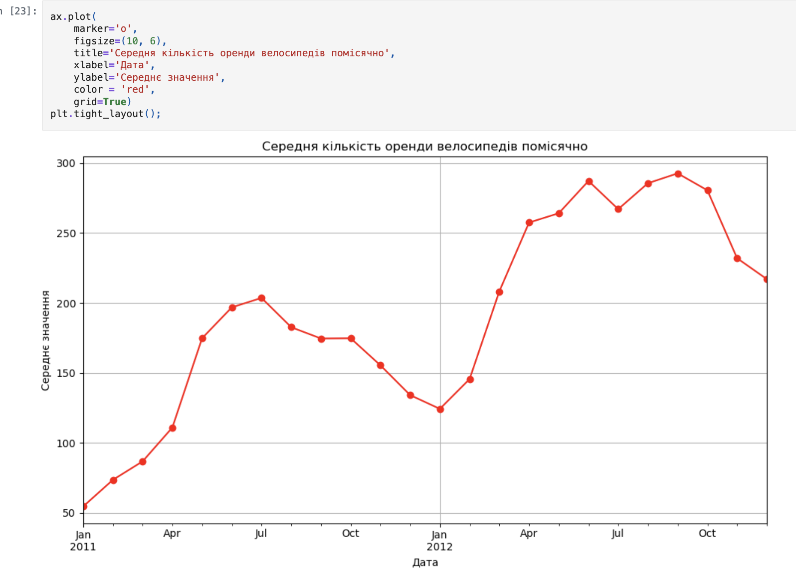
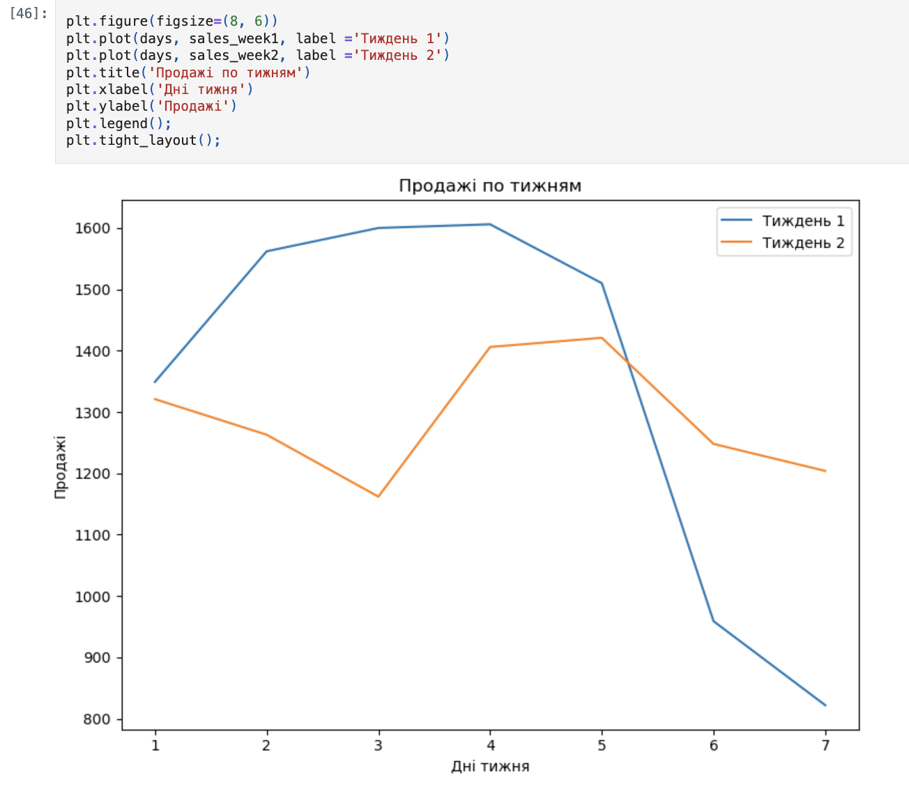
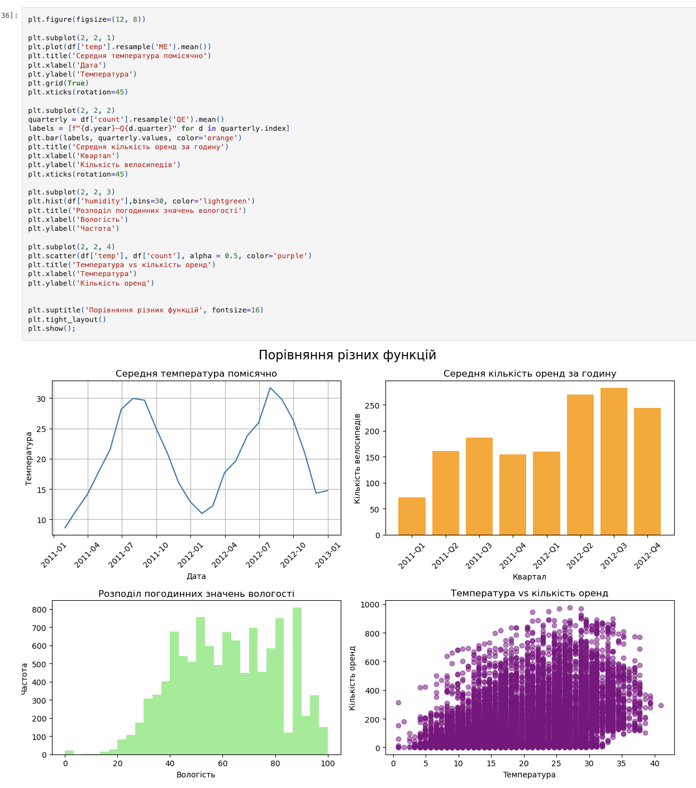

# 🚲 Bike Rental Analysis

## 🎯 Goal
Analyze bike rental data to understand how time, weather, and temperature affect demand.

---

## 📈 Visualizations

### Monthly Rentals

  

  

---

### Dashboard (2x2)

---

## 🔍 Key Insights

- 📈 Rentals increase in warmer months  
- 🌡 Higher temperature → more rentals  
- 💧 High humidity reduces demand  
- 📅 Demand varies by time and day  

---

## 🧠 What I used

- Python (pandas)
- Matplotlib
- resample()
- subplots()

---

## 💡 Conclusion

👉 Weather and season strongly affect bike demand  
👉 Useful for demand planning and pricing
